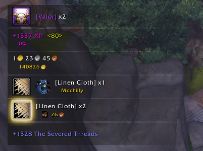
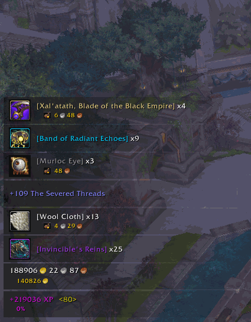
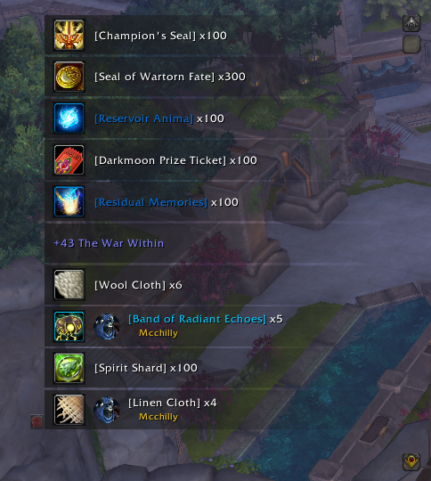

# RPGLootFeed

  

  

RPGLootFeed is a World of Warcraft addon designed to declutter your chat and enhance your looting experience by providing a dynamic and immersive loot feed. Keep your chat just for chat and let RPGLootFeed handle the rest.

As featured in SoulSoBreezy's _11 Useful Addons for Patch 11.0.7_

## Features

- **Declutter Your Chat**: Keep your chat window free from loot spam. RPGLootFeed displays all your looted items, currencies, reputation gains, and even profession skill-ups in a sleek, scrolling feed.
- **Contextual Information**: Get detailed information about looted items, currencies, and faction reputation gains. See the item count available to your character, currency cap information, reputation progress, and more at a glance.
- **Integrations**: Seamlessly integrates with popular addons like Auctionator, TradeSkillMaster (TSM) to provide additional contextual information and enhance your looting experience. Or apply your favorite Masque themes to RPGLootFeed so it fits in nicely with your custom UI experience.
- **Customizable**: Tailor the loot feed to your preferences. Choose what information to display and how it should be presented.

## Recommended Addons

Pair RPGLootFeed with Speedy AutoLoot by Yuyuli for an even better looting experience. Speed up looting by not showing the loot frame.

- [Speedy AutoLoot on CurseForge](https://www.curseforge.com/wow/addons/speedyautoloot)
- [Speedy AutoLoot on Wago](https://addons.wago.io/addons/speedy-autoloot)

## Installation

1. Download the latest release from [GitHub](https://github.com/Mctalian/RPGLootFeed/releases/latest) or [CurseForge](https://www.curseforge.com/wow/addons/rpglootfeed).
2. Extract the downloaded file into your World of Warcraft `Interface/AddOns` directory.
3. Restart World of Warcraft and enable RPGLootFeed in the AddOns menu.

## Contributing

Contributions are welcome from the community! If you encounter any issues or have suggestions for improvements, please open an issue on [GitHub](https://github.com/Mctalian/RPGLootFeed/issues). Or head over to [Discussions](https://github.com/Mctalian/RPGLootFeed/discussions) if you have any questions or want to show off your UI. For the fastest response, join the [Discord Community](https://discord.gg/czRYVWhe33).

If you're interested in contributing code, please see our [Contributing Guidelines](CONTRIBUTING.md) for more information.

## License

RPGLootFeed is licensed under the MIT License. See the [LICENSE](LICENSE) file for more information.

## Screenshots

